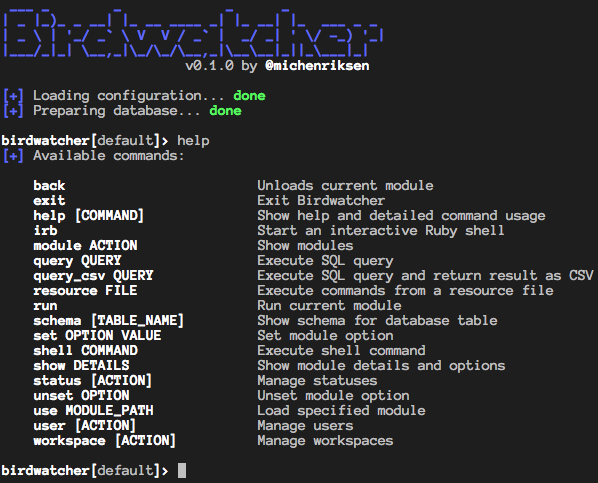
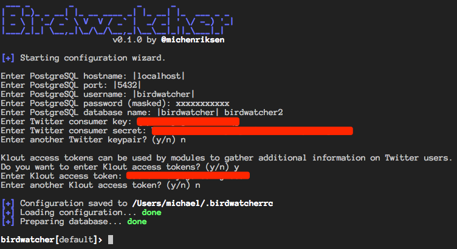
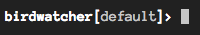

# Birdwatcher

[Birdwatcher](https://github.com/michenriksen/birdwatcher) is a data analysis and OSINT framework for Twitter. Birdwatcher supports creating multiple workspaces where arbitrary Twitter users can be added and their Tweets harvested through the Twitter API for offline storage and analysis. Birdwatcher comes with several modules which can be envoked to further enrich collected data or work with it, e.g. Retrieving user's Klout score, generating social graphs between users and weighted word clouds based on their Tweets.

## Installation

### 1. Ruby

Birdwatcher is written in [Ruby](https://www.ruby-lang.org/) and requires at least version 1.9.3 or above. To check which version of Ruby you have installed, simply run `ruby --version` in a terminal.

Should you have an older version installed, it is very easy to upgrade and manage different versions with the Ruby Version Manager ([RVM](https://rvm.io/)). Please see the [RVM website](https://rvm.io/) for installation instructions.

### 2. RubyGems

Birdwatcher is packaged as a Ruby gem to make it easy to install and update. To install Ruby gems you'll need the RubyGems tool installed. To check if you have it already, type `gem` in a Terminal. If you got it already, it is recommended to do a quick `gem update --system` to make sure you have the latest and greatest version. In case you don't have it installed, download it from [here](https://rubygems.org/pages/download) and follow the simple installation instructions.

### 3. PostgreSQL

Birdwatcher uses a PostgreSQL database to store all its data. If you are setting up Birdwatcher in the [Kali](https://www.kali.org/) linux distribution you already have it installed, you just need to make sure it's running by executing `service postgresql start` and perhaps install a dependency with `apt-get install libpq-dev` in a terminal. Here's an excellent [guide](https://www.digitalocean.com/community/tutorials/how-to-install-and-use-postgresql-9-4-on-debian-8) on how to install PostgreSQL on a Debian based Linux system. If you are setting up Birdwatcher on a Mac, the easiest way to install PostgreSQL is with [Homebrew](http://brew.sh/). Here's a [guide](http://exponential.io/blog/2015/02/21/install-postgresql-on-mac-os-x-via-brew/) on how to install PostgreSQL with Homebrew.

#### 3.1 PostgreSQL user and database

You need to set up a user and a database in PostgreSQL for Birdwatcher. Execute the following commands in a terminal:

    sudo su postgres # Not necessary on Mac OS X
    createuser -s birdwatcher --pwprompt
    createdb -O birdwatcher birdwatcher

You now have a new PostgreSQL user with the name `birdwatcher` and with the password you typed into the prompt. You also created a database with the name `birdwatcher` which is owned by the `birdwatcher` user.

### 4. Graphviz

Some Birdwatcher modules use [Graphviz](http://graphviz.org/) to generate visual graphs and other things. On a Mac you can install Graphviz with [homebrew](http://brew.sh/) by typing `brew update && brew install graphviz` in a terminal. On a Debian based Linux distro, Graphviz can be installed by typing `sudo apt-get update && sudo apt-get install graphviz` in a terminal.

### 5. ImageMagick

Some Birdwatcher modules use [ImageMagick](https://imagemagick.org/script/index.php) to generate images. On a Mac you can install Imagemagick with [homebrew](http://brew.sh/) by typing `brew update && brew install imagemagick` in a terminal. On a Debian based Linux distro, ImageMagick can be installed by typing `sudo apt-get update && sudo apt-get install libmagickwand-dev imagemagick` in a terminal.

### 6. Birdwatcher

Finally with all the dependencies in place, Birdwatcher can now be installed with a simple command in a terminal:

    $ gem install birdwatcher

This will download and set up Birdwatcher and install all its code depencies.

## Configuration

Birdwatcher needs to know a bit about what database to connect to as well as API keys to use for API communication. For Twitter, you will need to register an application in order to get a consumer key and consumer secret. Head over to [apps.twitter.com](https://apps.twitter.com/) and set up your application. You don't need to have a valid callback URL as we won't be doing any OAuth authentication.

To make Birdwatcher even more useful, it is recommended to also obtain an API key for the [Klout API](https://klout.com/s/developers/v2) which is required for some modules to work. If you don't intend to use Klout modules, you can of course skip this step.

On the first run, Birdwatcher will automatically start a configuration wizard where it will ask for the configuration it needs. If you have PostgreSQL connection details, Twitter consumer key & secret and optional Klout API key, you can start Birdwatcher for the first time:

    $ birdwatcher

Enter the details into the configuration wizard:

As can be seen from the above screenshot, Birdwatcher supports multiple Twitter and Klout keys. If you configure Birdwatcher with several keys it will randomly shuffle between them when communicating with APIs to potentially avoid any rate limiting issues on extensive use.

Birdwatcher will save its configuration to `~/.birdwatcherrc`. Be careful not to push this file up to any public code repositories!

### System pager

Birdwatcher pages long command output with the operating system's default pager command (usually `less`) however the command output can be colored and will show up strangely if the pager is not configured to render terminal colors. It is advised to add the following to your `~/.bash_profile` or similar file:

    # Get color support for 'less'
    export LESS="--raw-control-chars"
    export PAGER="less"

This will set up `less` as your default pager command as well as configure `less` to support terminal colors. Execute the command `source ~/.bash_profile` to apply the configuration immediately instead of next time you open a terminal.

## Usage

Birdwatcher is built as a console and if you have any experience with other frameworks such as [Metasploit](https://www.metasploit.com/) or [Recon-ng](https://bitbucket.org/LaNMaSteR53/recon-ng), you should feel right at home as Birdwatcher has many of the same concepts and commands.

### Workspaces

Birdwatcher, like Metasploit and Recon-ng, works with the concept of Workspaces. Workspaces enable you to segment and manage users and data stored in the database. You can use workspaces to create logical separation between different users. For example, you may want to create a workspace for a company, a department or for a specific topic.

Birdwatcher will always show the currently active workspace inside the square brackets on the command prompt:

There will always be a default workspace with the name `default` which might be enough if you plan to use Birdwatcher for a small group of Twitter users. Let's create a new workspace called `top5` that we can use for experimentation:

    birdwatcher[default]>  workspace create top5
    [+] Created workspace: top5
    birdwatcher[top5]>

The `workspace create` command created a new workspace and automatically made it the active workspace. Any user we add and any data we collect now will only be available in the `top5` workspace.

If we want to navigate between workspaces, we can do so by using the `workspace` command again:

    birdwatcher[top5]> workspace use default
    [+] Now using workspace: default
    birdwatcher[default]> workspace use top5
    [+] Now using workspace: top5
    birdwatcher[top5]>

With the above commands we switched over to the `default` workspace and then back again to the `top5` workspace.

### Commands

The core of the Birdwatcher framework is of course its commands. You already got an introduction to the `workspace` command in the previous section, but there are many more. One of the most important commands is `help`:

    birdwatcher[top5]> help
    [+] Available commands:

        back               		Unloads current module
        exit               		Exit Birdwatcher
        help [COMMAND]     		Show help and detailed command usage
        irb                		Start an interactive Ruby shell
        module ACTION      		Show modules
        query QUERY        		Execute SQL query
        query_csv QUERY    		Execute SQL query and return result as CSV
        resource FILE      		Execute commands from a resource file
        run                		Run current module
        schema [TABLE_NAME]		Show schema for database table
        set OPTION VALUE   		Set module option
        shell COMMAND      		Execute shell command
        show DETAILS       		Show module details and options
        status [ACTION]    		Manage statuses
        unset OPTION       		Unset module option
        use MODULE_PATH    		Load specified module
        user [ACTION]      		Manage users
        workspace [ACTION] 		Manage workspaces

    birdwatcher[top5]>

The help command simply lists the available commands with a short description of what they do. If we want to get more information on a specific command, e.g. the `workspace` command, we can execute the following:

    birdwatcher[top5]> help workspace

    Workspaces enable you to segment and manage users and data stored in the database.
    You can use workspaces to create logical separation between different users.
    For example, you may want to create a workspace for a company, a department or
    for a specific topic.

    There will always be a default workspace with the name default which might be enough
    if you plan to use Birdwatcher for a small group of Twitter users.

    USAGE:

    List available workspaces:
      workspace list

    Create a new workspace:
      workspace create NAME [DESCRIPTION]

    Switch to a workspace:
      workspace use NAME

    Delete a workspace:
      workspace delete NAME

    Rename a workspace
      workspace rename NAME NEW_NAME

    birdwatcher[top5]>

Another core command in Birdwatcher is the `user` command which can be used to add users to the workspace as well as updating or removing them at a later point.

As an example, let's add the top 5 most followed Twitter users from [this list](http://twittercounter.com/pages/100). At the time of writing it is:

 * Katy Perry ([@katyperry](https://twitter.com/katyperry))
 * Justin Bieber ([@justinbieber](https://twitter.com/justinbieber))
 * Taylor Swift ([@taylorswift13](https://twitter.com/taylorswift13))
 * Barack Obama ([@BarackObama](https://twitter.com/BarackObama))
 * Rihanna ([@rihanna](https://twitter.com/rihanna))

Execute the following command to add them to the workspace:

     birdwatcher[top5]> user add katyperry justinbieber taylorswift13 BarackObama rihanna
     [+] Added katyperry to workspace
     [+] Added justinbieber to workspace
     [+] Added taylorswift13 to workspace
     [+] Added BarackObama to workspace
     [+] Added rihanna to workspace
     birdwatcher[top5]>

Birdwatcher fetched basic information on the users through the Twitter API. A summary of users in the workspace can be seen with the `user list` command. For more information on what the `user` command can do, simply enter `help user`.

Now that we have a couple of users in the workspace we can look at the `status` command which is another core command of the Birdwatcher framework:

    birdwatcher[top5]> status fetch
    [+] Fetching statuses for BarackObama... done
    [+] Processing 1000 statuses... done
    [+] Fetching statuses for justinbieber... done
    [+] Processing 997 statuses... done
    [+] Fetching statuses for katyperry... done
    [+] Processing 998 statuses... done
    [+] Fetching statuses for rihanna... done
    [+] Processing 999 statuses... done
    [+] Fetching statuses for taylorswift13... done
    [+] Processing 996 statuses... done
    birdwatcher[top5]>

 The `status fetch` command fetches up to 1.000 statuses from the users in the workspace and saves them to the underlying database. The statuses are also processed to extract URLs, mentions and hashtags to separate database tables. Running `status fetch` at a later time will fetch any new statuses that the users might have posted since last fetch.

We can page through the last 1.000 statuses across all the users with the `status list` command:

    . . . .

    Justin Bieber (@justinbieber) * Oct  5, 23:50
    Proud of my buddies https://t.co/4vc0qfmSyA
    Favorites: 51505 | Retweets: 22434

    ================================================================================

    KATY PERRY (@katyperry) * Oct  5, 23:36
    You hear it as "excellent" I hear it as "egg salad with lint" 🤔
    Favorites: 14204 | Retweets: 4340

    ================================================================================

    Justin Bieber (@justinbieber) * Oct  5, 23:29
    Great show https://t.co/jgtRbU4RHC
    Favorites: 50799 | Retweets: 22617

    ================================================================================

    Barack Obama (@BarackObama) * Oct  5, 21:30
    This historic step in the fight to #ActOnClimate came faster than anyone predicted. https://t.co/W2rtcNXkI7
    Favorites: 5053 | Retweets: 1254

    ================================================================================

    Barack Obama (@BarackObama) * Oct  5, 20:44
    "Today is a historic day in the fight to protect our planet for future generations." —President Obama #ActOnClimate https://t.co/x3dJSCYUcj
    Favorites: 5500 | Retweets: 1652

    . . . .

It is also possible to page through statuses which contain a certain word or phrase with the `status search <word>` command. See `help status` for more usage on the `status` command.

### Modules

Being able to fetch Twitter users and statuses from the API is cool and all, but if that was all Birdwatcher would just be an offline Twitter client. Modules are where the fun begins. Modules either enrich collected data with more data (e.g. Klout score) or do some sort of work on the collected data.

Here are some of the things the modules can do:

  * Generate weighted word clouds based on statuses
  * Listing the most shared URLs in a certain time frame
  * Generate visual social graphs between users
  * Crawl shared URLs to fetch status codes, content types and page titles
  * Generate [KML](https://developers.google.com/kml/) files with geo-enabled statuses for viewing in [Google Earth](https://www.google.com/earth/)
  * Generate Punchard-style plots of when users are most engaged with Twitter

To see all available modules, use the `module list` command:

    birdwatcher[top5]> module list
    [+] Available Modules:

           Name: KML Document
    Description: Creates a KML document of statuses with Geo locations
           Path: statuses/kml

    ================================================================================

           Name: Status Sentiment Analysis
    Description: Enrich statuses with sentiment score
           Path: statuses/sentiment

    ================================================================================

    . . . .

    ================================================================================

           Name: User Klout Topics
    Description: Enrich users with their Klout topics
           Path: users/klout_topics

    ================================================================================

           Name: Social Graph
    Description: Graphs the social relations between users
           Path: users/social_graph

    ================================================================================

    birdwatcher[top5]>

The name, description and _path_ is listed for each available module. The module path is how the modules are divided up into folders on the file system. The folders can be seen as _namespaces_ and gives a clue about what sort of objects they work on.

The path is used to select modules with the `use` command:

    birdwatcher[top5]> use statuses/word_cloud
    birdwatcher[top5][statuses/word_cloud]>

The `use` command simply loads a module by providing the modules path as an argument. This also changes the command prompt to display the currently loaded module in square brackets next to the currently active workspace.

Now that we are inside the `statuses/word_cloud` module we may want to get a bit more information about it:

    birdwatcher[top5][statuses/word_cloud]> show info

           Name: Word Cloud
    Description: Generates a word cloud from statuses
         Author: Michael Henriksen <michenriksen@neomailbox.ch>
           Path: statuses/word_cloud

    ================================================================================

    The Word Cloud module can generate a classic weighted word cloud from words used
    in statuses across all or specific users and between different times.

    The module is heavily configurable; have a look at the options with show options

    Please note that configuring the module with a long timespan might result in a
    very long execution time when the word cloud image is generated.

    The generated image will be in PNG format.

    birdwatcher[top5][statuses/word_cloud]>

The `show info` command shows additional information on the module if available. It can also be used to see any configuration options the module might have:

    birdwatcher[top5][statuses/word_cloud]> show options

    ------------------------------------------------------------------------------------------------------------------------------------------
     Name                 Current Setting              Required  Description
    ------------------------------------------------------------------------------------------------------------------------------------------
     DEST                                              yes       Destination file
     USERS                                             no        Space-separated list of screen names (all users if empty)
     SINCE                                             no        Process statuses posted since specified time (last 7 days if empty)
     BEFORE                                            no        Process statuses posted before specified time (from now if empty)
     MIN_WORD_COUNT       3                            no        Exclude words mentioned fewer times than specified
     MIN_WORD_LENGTH      3                            no        Exclude words smaller than specified
     EXCLUDE_STOPWORDS    true                         no        Exclude english stopwords
     EXCLUDE_COMMON       true                         no        Exclude common english words
     EXCLUDE_WORDS                                     no        Space-separated list of words to exclude
     EXCLUDE_HASHTAGS     false                        no        Exclude Hashtags
     EXCLUDE_MENTIONS     true                         no        Exclude @username mentions
     INCLUDE_PAGE_TITLES  false                        no        Include web page titles from shared URLs (requires crawling with urls/crawl)
     WORD_CAP             200                          no        Cap list of words to specified amount
     PALETTE              #8F99AB #A3ADC2 #272A2F ...  yes       Space-separated list of hex color codes to use for word cloud
     IMAGE_WIDTH          1024                         yes       Image width in pixels
     IMAGE_HEIGHT         1024                         yes       Image height in pixels
    ------------------------------------------------------------------------------------------------------------------------------------------

    birdwatcher[top5][statuses/word_cloud]>

The `show options` command shows all of the configuration options for the loaded module. The `statuses/word_cloud` module happens to be one of the more configurable modules, but looking at the table we can see that only required option we need to set is the `DEST` option which tells the module where to write the final word cloud image. Because the workspace doesn't contain a whole lot of users we will also set the `SINCE` option to `6 months ago` in order to make a word cloud of what the Top 5 Twitter users have been talking about through the last 6 months. On a side note, all module options that have something to do with dates and times are processed with [Chronic](https://github.com/mojombo/chronic) gem for natural language processing; see the [examples](https://github.com/mojombo/chronic#examples) for what is supported.

    birdwatcher[top5][statuses/word_cloud]> set DEST /tmp/wordcloud.png
    birdwatcher[top5][statuses/word_cloud]> set SINCE 6 months ago
    birdwatcher[top5][statuses/word_cloud]> run
    [+] Processing 1542 statuses... done
    [+] Generating word cloud, patience please... done
    [+] Word cloud written to /tmp/wordcloud.png
    birdwatcher[top5][statuses/word_cloud]>

After a couple of seconds the module wrote the word cloud image to `/tmo/wordcloud.png`. The result is:

### Power User Features

Since everything is stored in a database, it is possible to perform arbitrary SQL queries against the data if you know the SQL language:

#### Raw SQL

    birdwatcher[top5]> query select name, screen_name, followers_count from users where workspace_id = 2 order by followers_count DESC

    +---------------+---------------+-----------------+
    | name          | screen_name   | followers_count |
    +---------------+---------------+-----------------+
    | KATY PERRY    | katyperry     | 93379238        |
    | Justin Bieber | justinbieber  | 88715066        |
    | Taylor Swift  | taylorswift13 | 81158756        |
    | Barack Obama  | BarackObama   | 77850900        |
    | Rihanna       | rihanna       | 66491106        |
    +---------------+---------------+-----------------+

The `query` command will execute any SQL query it receives as an argument and output the result in a table. As can be seen in the command example, the `query` command does not know how to scope the data to the currently active workspace, so you will have to take care of that in your queries. Usually rows can be scoped by filtering on `workspace_id = ?` in tables. The current workspace ID can be retrieved by issuing the `workspace` command.

#### Outputting in CSV Format

If you want to extract data with raw SQL and want it to be easily parsable by other applications or code, you can use the `query_csv` command. It works similarly to `query` but outputs the result in CSV format:

    birdwatcher[top5]> query_csv select name, screen_name, followers_count from users where workspace_id = 2 order by followers_count DESC
    name,screen_name,followers_count
    KATY PERRY,katyperry,93379238
    Justin Bieber,justinbieber,88715066
    Taylor Swift,taylorswift13,81158756
    Barack Obama,BarackObama,77850900
    Rihanna,rihanna,66491106

#### Getting Schema Information

Performing raw SQL queries against Birdwatcher's database can be hard if you don't know how the tables are layed out. To get a list of available tables to inspect, you can use the `schema` command:

    birdwatcher[default]> schema
    [+] Available tables:

     * hashtags
     * hashtags_statuses
     * influencees
     * influencees_users
     * influencers
     * influencers_users
     * klout_topics
     * klout_topics_users
     * mentions
     * mentions_statuses
     * schema_info
     * statuses
     * statuses_urls
     * urls
     * users
     * workspaces

    birdwatcher[default]>

Giving the `schema` command a table name as an argument will show detailed schema information, indexes and foreign keys for that table:

    birdwatcher[default]> schema urls
    [+] Schema information for table urls:

    +--------------+-----------------------------+----------------------------------+------------+-------------+
    | Column Name  | Type                        | Default                          | Allow NULL | Primary Key |
    +--------------+-----------------------------+----------------------------------+------------+-------------+
    | id           | integer                     | nextval('urls_id_seq'::regclass) | No         | Yes         |
    | workspace_id | integer                     | NULL                             | Yes        | No          |
    | url          | text                        | NULL                             | Yes        | No          |
    | final_url    | text                        | NULL                             | Yes        | No          |
    | http_status  | integer                     | NULL                             | Yes        | No          |
    | content_type | text                        | NULL                             | Yes        | No          |
    | title        | text                        | NULL                             | Yes        | No          |
    | crawled_at   | timestamp without time zone | NULL                             | Yes        | No          |
    | updated_at   | timestamp without time zone | NULL                             | Yes        | No          |
    | created_at   | timestamp without time zone | NULL                             | Yes        | No          |
    +--------------+-----------------------------+----------------------------------+------------+-------------+

    [+] Indexes on table urls:

    +-------------------------+--------------+--------+
    | Index Name              | Column(s)    | Unique |
    +-------------------------+--------------+--------+
    | urls_content_type_index | content_type | No     |
    | urls_crawled_at_index   | crawled_at   | No     |
    | urls_created_at_index   | created_at   | No     |
    | urls_final_url_index    | final_url    | No     |
    | urls_http_status_index  | http_status  | No     |
    | urls_title_index        | title        | No     |
    | urls_updated_at_index   | updated_at   | No     |
    | urls_url_index          | url          | No     |
    | urls_workspace_id_index | workspace_id | No     |
    +-------------------------+--------------+--------+

    [+] Foreign keys on table urls:

    +--------------+------------------+----------------------+
    | Column(s)    | Referenced Table | Referenced Column(s) |
    +--------------+------------------+----------------------+
    | workspace_id | workspaces       | id                   |
    +--------------+------------------+----------------------+

    birdwatcher[default]>

If you want a graphical ER diagram, you can [find one here](img/birdwatcher_schema.png)

#### Interactive Ruby Shell

If you really know what you are doing and know the ins and outs of Birdwatcher's code, you can use the `irb` command to get an interactive Ruby shell ([IRB](http://ruby-doc.org/stdlib-2.0.0/libdoc/irb/rdoc/IRB.html)) where all of Birdwatcher's classes and models are available. You can use this command for debugging or for more complex, one-off data manipulation where building a module isn't suitable.

## Development

### Modules

For information on how to create a Birdwatcher module, please see this [Wiki page](https://github.com/michenriksen/birdwatcher/wiki/Creating-a-Birdwatcher-Module).

## License

Birdwatcher is available as open source under the terms of the [MIT License](http://opensource.org/licenses/MIT).

